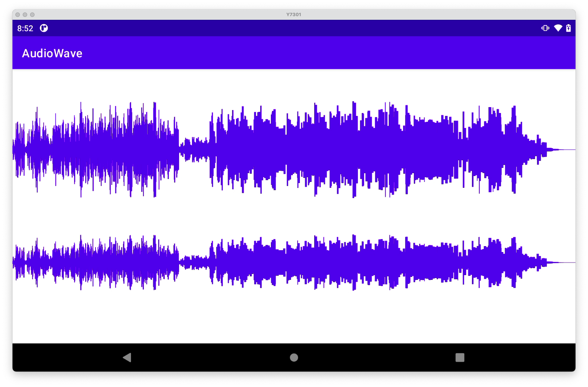

波形图
--

#### 1、导入依赖

~~~groovy
maven { url "https://jitpack.io" }

// 替换成最后的 release 版本号
implementation 'com.github.Jin-Yx:AudioWave:last_release_version'
~~~

#### 2、layout 布局

~~~xml
<com.jinyx.audiowave.WaveView
    android:id="@+id/waveView1"
    android:layout_width="match_parent"
    android:layout_height="0dp"
    android:layout_weight="6"
    app:waveAutoScale="true"
    app:waveColor="@color/purple_500"
    app:waveCount="1920"
    app:waveMaxScale="32767"/>
~~~

&emsp;&emsp;属性说明:

- `waveAutoScale`: 控制波形图的高度值是否根据波峰动态缩放
- `waveColor`: 设置波形颜色
- `waveCount`: 设置一个屏幕宽度能绘制的波形线数量，不能小于屏幕宽像素的 1/10，默认 640；
- `waveMaxScale`: 当 `waveAutoScale` 为 false 时，表示当前显示的最大的波峰值，实际上的波峰值为一个音频采样点（2个字节）的最大值，即 Short.MAX_VALUE

#### 3、使用

- `waveview.clear()`: 用于清空之前绘制的波形图
- `waveView.feedAudioData(audio: ByteArray)`: 送入音频数据，每一组对应绘制一条波形线，绘制超过屏幕后会自动滚动
- `waveView.stop()`: 结束绘制后调用，波形图回到开始位置

#### 4、示例 Demo：

&emsp;&emsp;[录音数据](./app/src/main/java/com/jinyx/audiowave/WaveRecordActivity.kt) &emsp;&emsp;&emsp; [音频文件数据](./app/src/main/java/com/jinyx/audiowave/WaveFileActivity.kt)

 
